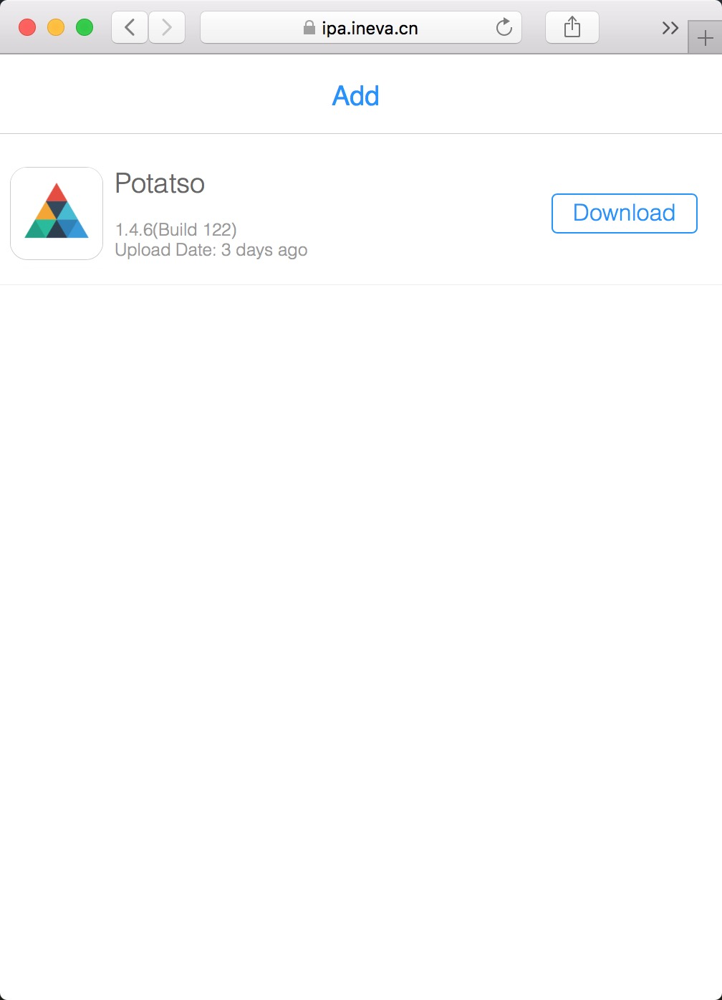
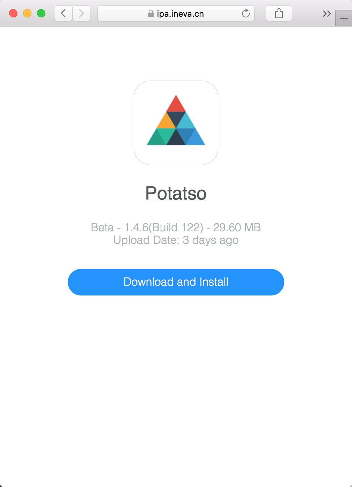

# ipa-server

Upload and install IPA in web.

* [中文文档](README_zh.md)

# Online Demo

<https://ipa.ineva.cn>

⚠️ Note About This Demo:

* For test only
* Server is deploy in China
* Bandwidth only 1Mb/s
* DO NOT USE THIS ON PRODUCTION

# Install

```
$ git clone https://github.com/iineva/ipa-server
$ cd ipa-server
$ docker-compose up -d
```

# Test

Open <http://<HOST_NAME>:9008> in your browser.

# Docker Deploy

* This server is not included SSL certificate. It must run behide the reverse proxy with HTTPS.

* There is a simple way to setup a HTTPS with replace `docker-compose.yml` file:

```

# ***** Replace ALL <YOUR_DOMAIN> to you really domain *****

version: "2"

services:
  web:
    image: ineva/ipa-server:latest
    container_name: ipa-server
    restart: always
    environment:
      - NODE_ENV=production
      - PUBLIC_URL=https://<YOUR_DOMAIN>
    volumes:
      - "/docker/data/ipa-server:/app/upload"
  caddy:
    image: abiosoft/caddy:0.11.5
    restart: always
    ports:
      - "80:80"
      - "443:443"
    entrypoint: |
      sh -c 'echo "$$CADDY_CONFIG" > /etc/Caddyfile && /usr/bin/caddy --conf /etc/Caddyfile --log stdout'
    environment:
      CADDY_CONFIG: |
        <YOUR_DOMAIN> {
          gzip
          proxy / web:8080
        }
```

# Deploy Without Docker

```shell
# install node.js first
npm install
npm start
```


* now you can access *https://\<YOUR_DOMAIN\>* in your browser.

# Upload Access Control

Server side:

Add `ACCESS_KEY` to system environment as password.

Client side:

Browser open: https://\<YOUR_DOMAIN\>/key.html?key=\<ACCESS_KEY\>


Home | Detail |
 --- | ---
 | 
