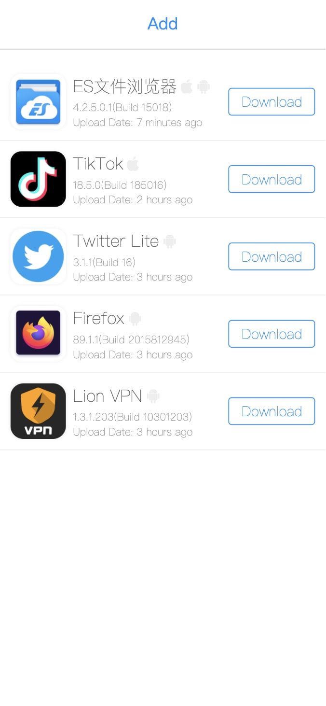
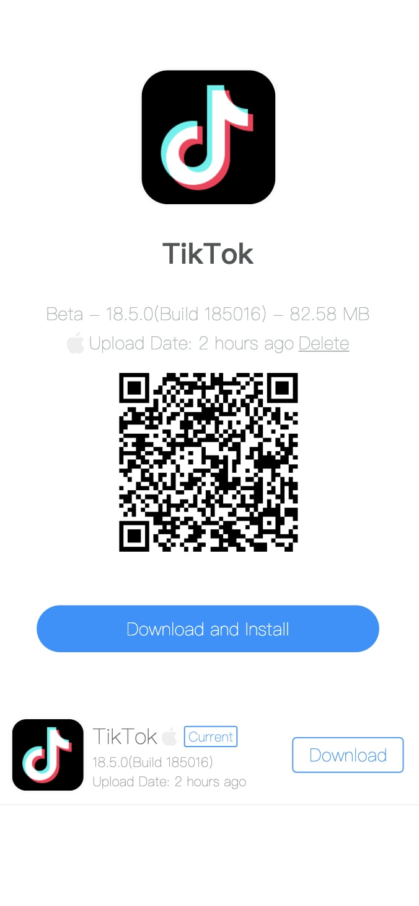

# ipa-server

ipa-server is updated to v2, to [older version v1](https://github.com/iineva/ipa-server/tree/v1)

Upload and install Apple `.ipa` and Android `.apk` in web.

# Demo

<https://ipasd.herokuapp.com/>

## Key features

* Automatic parse packet information
* Automatically generate icons
* Parse icons from `Assets.car` 
* Out of the box
* Free depoly, use `Heroku` as runtime and `Ali OSS` as storage, Both of them provide HTTPS access for free
* The generated files are completely stored in external storage. Currently, it supports `S3` `Qiniu` `Alibaba Cloud OSS`
* A single binary build-in all you need

* [中文文档](README_zh.md)

Home | Detail |
 --- | ---
 | 

# Install for local trial

```shell
# clone
git clone https://github.com/iineva/ipa-server
# build and start
cd ipa-server
docker-compose up -d
# than open http://localhost:9008 in your browser.
```

# Heroku Deploy

### config

* PUBLIC_URL: public URL for this server, empty to use `$DOMAIN`
* REMOTE: remote storager config, `s3://ENDPOINT:AK:SK:BUCKET` `alioss://ENDPOINT:AK:SK:BUCKET` `qiniu://[ZONE]:AK:SK:BUCKET`
* REMOTE_URL: remote storager public url, https://cdn.example.com
* DELETE_ENABLED: delete app enabled, `true` `false`

[](https://heroku.com/deploy?template=https://github.com/iineva/ipa-server)

# Docker Deploy

* This server is not included SSL certificate. It must run behide the reverse proxy with HTTPS.

* After deployed, you can access *https://\<YOUR_DOMAIN\>* in your browser.

* There is a simple way to setup a HTTPS with replace `docker-compose.yml` file:

```

# ***** Replace ALL <YOUR_DOMAIN> to you really domain *****

version: "3"
services:
  web:
    image: ineva/ipa-server:latest
    container_name: ipa-server
    restart: unless-stopped
    environment:
      # server public url
      - PUBLIC_URL=https://<YOUR_DOMAIN>
      # option, remote storager config, s3://ENDPOINT:AK:SK:BUCKET, alioss://ENDPOINT:AK:SK:BUCKET, qiniu://[ZONE]:AK:SK:BUCKET
      - REMOTE=
      # option, remote storager public url, https://cdn.example.com
      - REMOTE_URL=
      # option, metadata storage path, use random secret path to keep your metadata safer in case of remote storage
      - META_PATH=appList.json
      # delete app enabled, true/false
      - DELETE_ENABLED="false"
    volumes:
      - "/docker/data/ipa-server:/app/upload"
  caddy:
    image: ineva/caddy:2.4.1
    restart: unless-stopped
    ports:
      - 80:80
      - 443:443
    entrypoint: |
      sh -c 'echo "$$CADDY_CONFIG" > /srv/Caddyfile && /usr/bin/caddy run --config /srv/Caddyfile'
    environment:
      CADDY_CONFIG: |
        <YOUR_DOMAIN> {
          reverse_proxy web:8080
        }
```

# Build or run from source code

```shell
# install golang v1.16 first
git clone https://github.com/iineva/ipa-server
# build and start
cd ipa-server
# build binary
make build
# run local server
make
```
