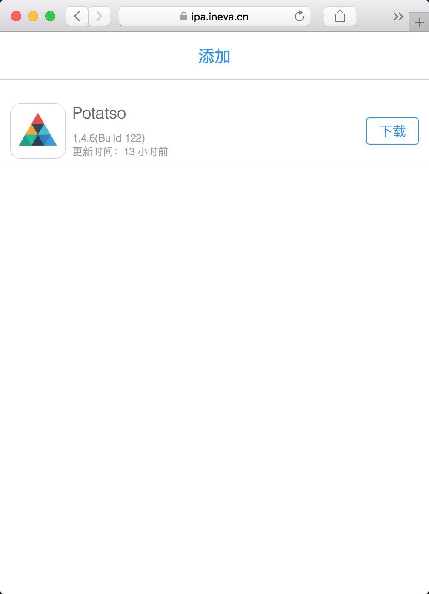
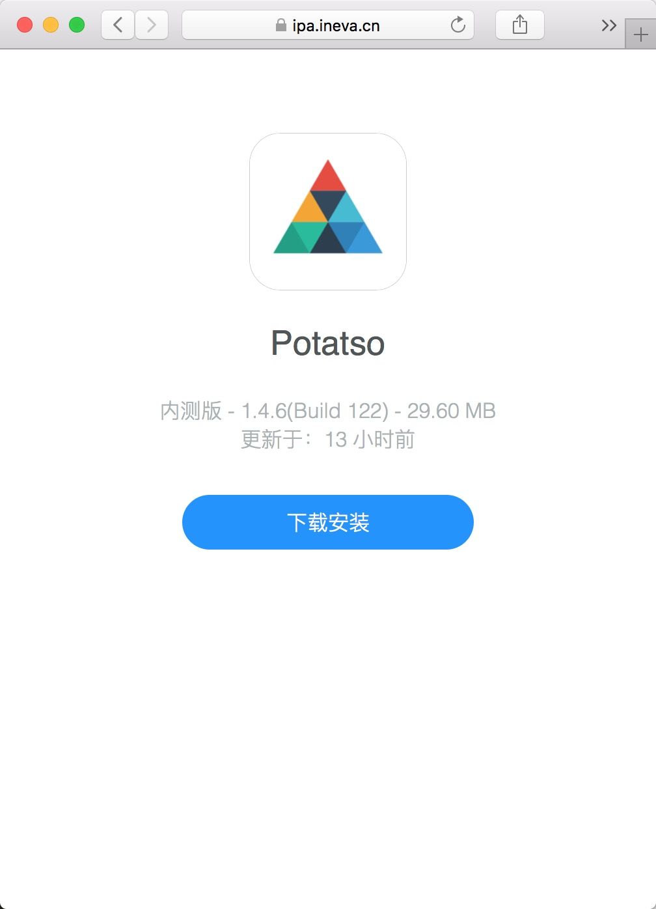

# ipa-server

使用浏览器上传和部署 `.ipa` 文件

* 自动识别ipa包内信息
* 自动生成图标
* 开箱即用
* 只需要一台低配云主机, 一个域名

# 在线试用Demo

<https://ipa.ineva.cn>

⚠️ 注意:

* 次服务器只能用于测试
* 带宽只有 1Mb/s
* 千万不要用在生成环境

# 安装部署

```
$ git clone https://github.com/iineva/ipa-server
$ cd ipa-server
$ docker-compose up -d
```

# 试用

打开在浏览器中打开 <http://<HOST_NAME>:9008>

# 正式部署

* 本仓库代码不包含SSL证书部分，由于苹果在线安装必须具备HTTPS，所以本程序必须运行在HTTPS反向代理后端。

* 最简单的办法开启完整服务，使用下面的配置替换 `docker-compose.yml` 文件:

```

# ***** 更换所有 <YOUR_DOMAIN> 成你的真实域名 *****

version: "2"

services:
  web:
    image: ineva/ipa-server:latest
    container_name: ipa-server
    restart: always
    environment:
      - NODE_ENV=production
      - PUBLIC_URL=https://<YOUR_DOMAIN>
    volumes:
      - "/docker/data/ipa-server:/app/upload"
  caddy:
    image: abiosoft/caddy:0.11.5
    restart: always
    ports:
      - "80:80"
      - "443:443"
    entrypoint: |
      sh -c 'echo "$$CADDY_CONFIG" > /etc/Caddyfile && /usr/bin/caddy --conf /etc/Caddyfile --log stdout'
    environment:
      CADDY_CONFIG: |
        <YOUR_DOMAIN> {
          gzip
          proxy / web:8080
        }
```

* 现在你可以使用浏览器访问 *https://\<YOUR_DOMAIN\>*


# 上传访问控制

服务端:

添加系统环境变量 `ACCESS_KEY` 作为密码。

客户端:

浏览器访问: https://\<YOUR_DOMAIN\>/key.html?key=\<ACCESS_KEY\>


首页 | 详情 |
 --- | ---
 | 
