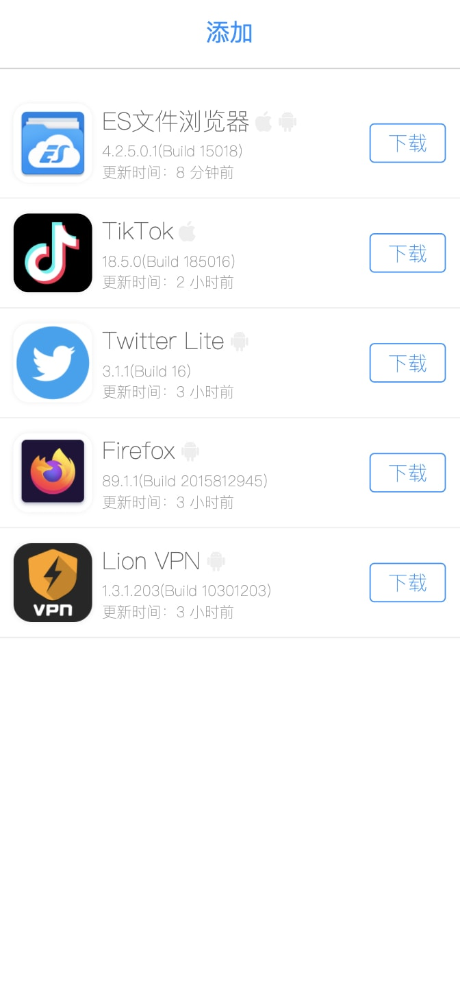

# ipa-server

ipa-server 已经更新到v2, 使用golang重构, [老版本v1](https://github.com/iineva/ipa-server/tree/v1)

使用浏览器上传和部署 苹果 `.ipa` 和 安卓 `.apk` 文件

# Demo

<https://ipasd.herokuapp.com/>

## 关键特性

* 自动识别包内信息
* 自动读取图标
* 支持解析`ipa`文件`Assets.car`内图标
* 开箱即用
* 可完全免费一键部署，使用`Heroku`作为runtime，`阿里OSS`做存储器，他们都提供免费的HTTPS访问
* 支持生成文件完全存储在外部存储，目前支持 `S3` `七牛对象存储` `阿里云OSS`
* 单二进制文件包含所有运行所需

Home | Detail |
 --- | ---
 | 

# 安装本地试用

```shell
# clone
git clone https://github.com/iineva/ipa-server
# build and start
cd ipa-server
docker-compose up -d
# 启动后在浏览器打开 http://localhost:9008
```

# Heroku 部署

### 配置

* PUBLIC_URL: 本服务的公网URL, 如果为空试用Heroku默认的 `$DOMAIN`
* REMOTE: option, 远程存储配置, `s3://ENDPOINT:AK:SK:BUCKET` `alioss://ENDPOINT:AK:SK:BUCKET` `qiniu://[ZONE]:AK:SK:BUCKET`
* REMOTE_URL: option, 远程存储访问URL, 注意需要开启HTTPS支持iOS才能正常安装！例子：https://cdn.example.com
* DELETE_ENABLED: 是否开启删除APP功能 `true` `false`

[](https://heroku.com/deploy?template=https://github.com/iineva/ipa-server)

# 正式部署

* 本仓库代码不包含SSL证书部分，由于苹果在线安装必须具备HTTPS，所以本程序必须运行在HTTPS反向代理后端。

* 部署后，你可以使用浏览器访问 *https://\<YOUR_DOMAIN\>*

* 最简单的办法开启完整服务，使用下面的配置替换 `docker-compose.yml` 文件:

```

# ***** 更换所有 <YOUR_DOMAIN> 成你的真实域名 *****

version: "3"
services:
  web:
    image: ineva/ipa-server:latest
    container_name: ipa-server
    restart: unless-stopped
    environment:
      # 本服务公网IP
      - PUBLIC_URL=https://<YOUR_DOMAIN>
      # option, 远程存储配置, s3://ENDPOINT:AK:SK:BUCKET, alioss://ENDPOINT:AK:SK:BUCKET, qiniu://[ZONE]:AK:SK:BUCKET
      - REMOTE=
      # option, 远程存储访问URL, https://cdn.example.com
      - REMOTE_URL=
      # option, 元数据存储路径, 使用一个随机路径来保护元数据，因为在使用远程存储的时候，没有更好的方法防止外部直接访问元数据文件
      - META_PATH=appList.json
      # 是否开启删除APP功能, true/false
      - DELETE_ENABLED="false"
    volumes:
      - "/docker/data/ipa-server:/app/upload"
  caddy:
    image: ineva/caddy:2.4.1
    restart: unless-stopped
    ports:
      - 80:80
      - 443:443
    entrypoint: |
      sh -c 'echo "$$CADDY_CONFIG" > /srv/Caddyfile && /usr/bin/caddy run --config /srv/Caddyfile'
    environment:
      CADDY_CONFIG: |
        <YOUR_DOMAIN> {
          reverse_proxy web:8080
        }
```

# 源码编译

```shell
# install golang v1.16 first
git clone https://github.com/iineva/ipa-server
# build and start
cd ipa-server
# build binary
make build
# run local server
make
```

# TODO

- [ ] 设计全新的鉴权方式，初步考虑试用GitHub登录鉴权
- [x] 支持七牛存储
- [x] 支持阿里云OSS存储
- [x] 支持S3存储
- [x] 兼容v1产生数据，无缝升级
- [ ] 支持命令行生成静态文件部署
